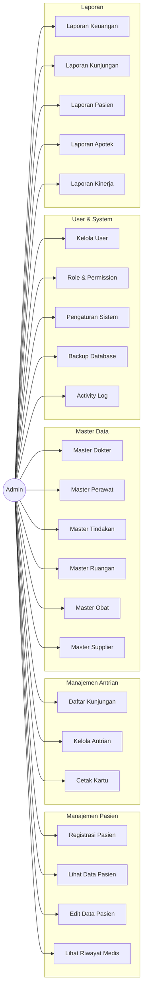
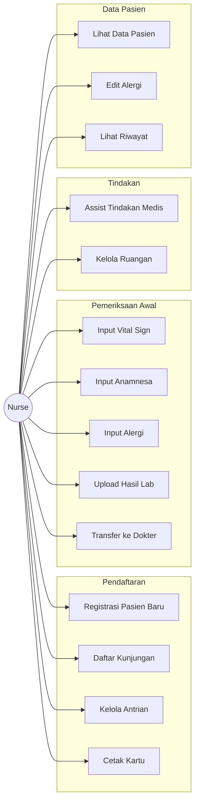
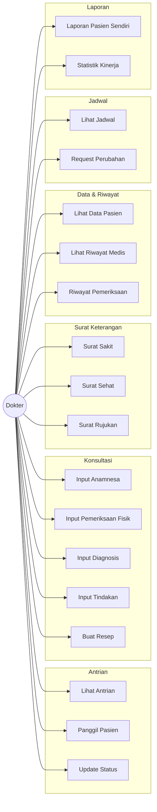
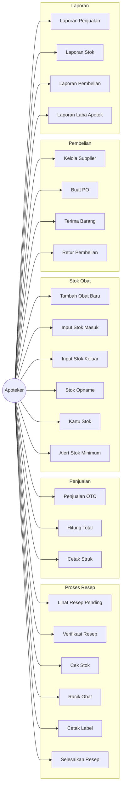
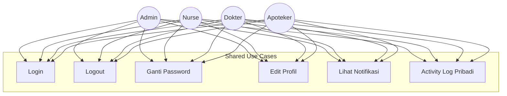

# Use Case Diagram - Sistem Informasi Klinik

## Use Case Diagram Lengkap - Semua Role dalam Satu Diagram

```mermaid
%%{init: {'theme':'default'}}%%
flowchart TB
    %% Actors
    Admin((Admin))
    Nurse((Nurse<br/>Perawat))
    Doctor((Dokter))
    Pharmacist((Apoteker))
    
    subgraph System["SISTEM INFORMASI KLINIK"]
        
        subgraph Auth["AUTENTIKASI & PROFIL"]
            UC1[Login]
            UC2[Logout]
            UC3[Ganti Password]
            UC4[Edit Profil]
            UC5[Lihat Notifikasi]
        end
        
        subgraph Patient["MANAJEMEN PASIEN"]
            UC6[Registrasi Pasien Baru]
            UC7[Lihat Data Pasien]
            UC8[Edit Data Pasien]
            UC9[Hapus Data Pasien]
            UC10[Lihat Riwayat Medis]
            UC11[Export Data Pasien]
        end
        
        subgraph Queue["PENDAFTARAN & ANTRIAN"]
            UC12[Daftar Kunjungan]
            UC13[Kelola Antrian]
            UC14[Panggil Antrian]
            UC15[Update Status Antrian]
            UC16[Cetak Kartu Antrian]
            UC17[Monitor Antrian]
        end
        
        subgraph Screening["PEMERIKSAAN AWAL"]
            UC18[Input Vital Sign]
            UC19[Input Anamnesa Awal]
            UC20[Input Alergi]
            UC21[Upload Hasil Lab]
            UC22[Transfer ke Dokter]
        end
        
        subgraph Examination["KONSULTASI DOKTER"]
            UC23[Input Anamnesa Lengkap]
            UC24[Input Pemeriksaan Fisik]
            UC25[Input Diagnosis]
            UC26[Input Tindakan Medis]
            UC27[Buat Resep Obat]
            UC28[Lihat Riwayat Pemeriksaan]
        end
        
        subgraph Certificate["SURAT KETERANGAN"]
            UC29[Buat Surat Sakit]
            UC30[Buat Surat Sehat]
            UC31[Buat Surat Rujukan]
        end
        
        subgraph Pharmacy["APOTEK & RESEP"]
            UC32[Lihat Resep Pending]
            UC33[Verifikasi Resep]
            UC34[Racik Obat]
            UC35[Cetak Label Obat]
            UC36[Penjualan OTC]
            UC37[Hitung Total Obat]
        end
        
        subgraph Stock["MANAJEMEN STOK"]
            UC38[Tambah Obat Baru]
            UC39[Input Stok Masuk]
            UC40[Input Stok Keluar]
            UC41[Stok Opname]
            UC42[Lihat Kartu Stok]
            UC43[Alert Stok Minimum]
            UC44[Alert Obat Kadaluarsa]
        end
        
        subgraph Purchase["PEMBELIAN"]
            UC45[Kelola Supplier]
            UC46[Buat Purchase Order]
            UC47[Terima Barang]
            UC48[Retur Pembelian]
        end
        
        subgraph Payment["PEMBAYARAN"]
            UC49[Lihat Tagihan]
            UC50[Proses Pembayaran]
            UC51[Apply Diskon]
            UC52[Cetak Kuitansi]
            UC53[Kelola Cicilan]
        end
        
        subgraph Master["MASTER DATA"]
            UC54[Kelola Master Dokter]
            UC55[Kelola Master Perawat]
            UC56[Kelola Master Tindakan]
            UC57[Kelola Master Ruangan]
            UC58[Kelola Master Poli]
            UC59[Kelola Master Diagnosis]
        end
        
        subgraph User["MANAJEMEN USER"]
            UC60[Tambah User]
            UC61[Edit User]
            UC62[Hapus User]
            UC63[Reset Password]
            UC64[Kelola Role Permission]
        end
        
        subgraph Report["LAPORAN"]
            UC65[Laporan Keuangan]
            UC66[Laporan Kunjungan]
            UC67[Laporan Pasien]
            UC68[Laporan Apotek]
            UC69[Laporan Kinerja]
            UC70[Export Laporan]
        end
        
        subgraph Setting["PENGATURAN SISTEM"]
            UC71[Pengaturan Umum]
            UC72[Pengaturan Tarif]
            UC73[Pengaturan Notifikasi]
            UC74[Backup Database]
            UC75[Restore Database]
            UC76[Activity Log]
        end
    end
    
    %% ADMIN CONNECTIONS
    Admin --- UC1 & UC2 & UC3 & UC4 & UC5
    Admin --- UC6 & UC7 & UC8 & UC9 & UC10 & UC11
    Admin --- UC12 & UC13 & UC14 & UC15 & UC16 & UC17
    Admin --- UC49 & UC50 & UC51 & UC52 & UC53
    Admin --- UC54 & UC55 & UC56 & UC57 & UC58 & UC59
    Admin --- UC60 & UC61 & UC62 & UC63 & UC64
    Admin --- UC65 & UC66 & UC67 & UC68 & UC69 & UC70
    Admin --- UC71 & UC72 & UC73 & UC74 & UC75 & UC76
    
    %% NURSE CONNECTIONS
    Nurse --- UC1 & UC2 & UC3 & UC4 & UC5
    Nurse --- UC6 & UC7 & UC8 & UC10
    Nurse --- UC12 & UC13 & UC14 & UC15 & UC16 & UC17
    Nurse --- UC18 & UC19 & UC20 & UC21 & UC22
    Nurse --- UC26
    
    %% DOCTOR CONNECTIONS
    Doctor --- UC1 & UC2 & UC3 & UC4 & UC5
    Doctor --- UC7 & UC10
    Doctor --- UC14 & UC15 & UC17
    Doctor --- UC23 & UC24 & UC25 & UC26 & UC27 & UC28
    Doctor --- UC29 & UC30 & UC31
    Doctor --- UC66 & UC70
    
    %% PHARMACIST CONNECTIONS
    Pharmacist --- UC1 & UC2 & UC3 & UC4 & UC5
    Pharmacist --- UC32 & UC33 & UC34 & UC35 & UC36 & UC37
    Pharmacist --- UC38 & UC39 & UC40 & UC41 & UC42 & UC43 & UC44
    Pharmacist --- UC45 & UC46 & UC47 & UC48
    Pharmacist --- UC49 & UC50 & UC52
    Pharmacist --- UC68 & UC70
    
    %% Styling
    classDef actorStyle fill:#FFE5B4,stroke:#FF8C00,stroke-width:3px
    classDef ucStyle fill:#E6F3FF,stroke:#4A90E2,stroke-width:2px
    classDef moduleStyle fill:#F0F0F0,stroke:#666,stroke-width:2px
    
    class Admin,Nurse,Doctor,Pharmacist actorStyle
    class UC1,UC2,UC3,UC4,UC5,UC6,UC7,UC8,UC9,UC10,UC11,UC12,UC13,UC14,UC15,UC16,UC17,UC18,UC19,UC20,UC21,UC22,UC23,UC24,UC25,UC26,UC27,UC28,UC29,UC30,UC31,UC32,UC33,UC34,UC35,UC36,UC37,UC38,UC39,UC40,UC41,UC42,UC43,UC44,UC45,UC46,UC47,UC48,UC49,UC50,UC51,UC52,UC53,UC54,UC55,UC56,UC57,UC58,UC59,UC60,UC61,UC62,UC63,UC64,UC65,UC66,UC67,UC68,UC69,UC70,UC71,UC72,UC73,UC74,UC75,UC76 ucStyle
```

## Use Case Diagram per Role

### 1. Admin Use Cases

### 2. Nurse (Perawat) Use Cases

### 3. Doctor (Dokter) Use Cases

### 4. Pharmacist (Apoteker) Use Cases

## Use Case Shared Antar Role

## Cara Menggunakan

1. **Lihat di VS Code**: Install extension "Markdown Preview Mermaid Support"
2. **Export ke Image**: 
   - Buka file ini di VS Code
   - Klik kanan pada diagram
   - Pilih "Export to PNG/SVG"
3. **Online Viewer**: Copy paste kode mermaid ke https://mermaid.live

## Keterangan

- **Garis solid (—>)**: Interaksi utama
- **Garis putus-putus (-.->)**: Interaksi opsional/shared
- **Subgraph**: Pengelompokan use case berdasarkan modul
